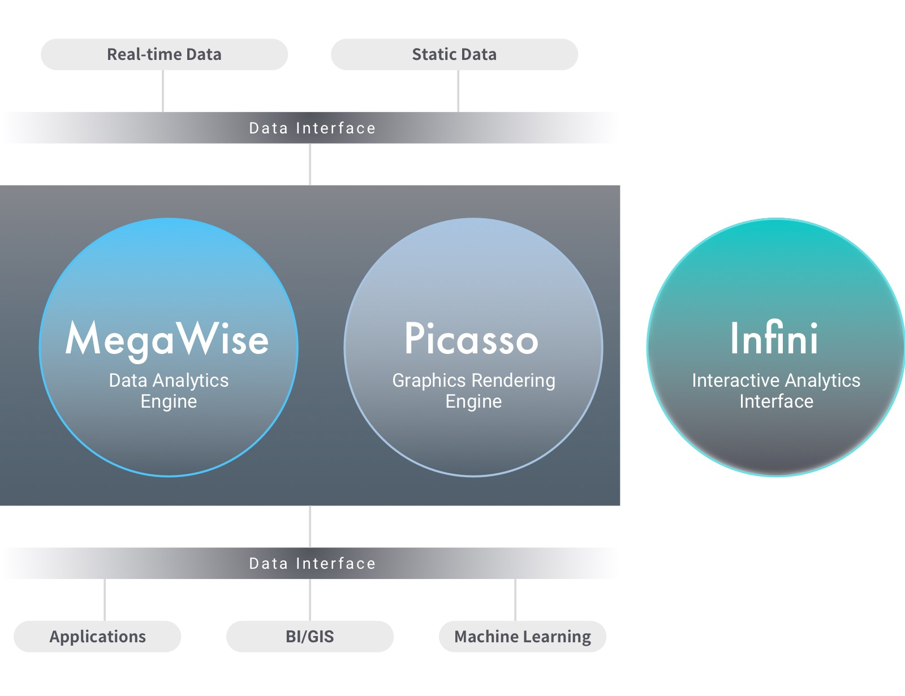

# Visualized, Interactive Analytics Platform for Leaders in Logistics - ZILLIZ Analytics

## Abstract

In *Automotive revolution – perspective towards 2030*, McKinsey described four disruptive technology-driven trends in the automotive sector: diverse mobility, autonomous driving, electrification, and connectivity. Each trend indicates that millions of new storage buckets of data are flowing into global manufacturers, logistics companies, and automobile management companies.

Unfortunately, CPU-based traditional hardware and analytics solutions are too slow and difficult to scale. Despite heavy investment, too much valuable remote information needs to be deleted for pre-aggregation and downsampling. As a result, much information is lost, leading to undetailed opinions and wrong conclusions.

Leaders in logistics wish to make strategic decisions to save fuel consumption, ensure operator security, decrease maintenance costs, and improve vehicle usability as soon as possible.

- 98% of logistics companies believe data-driven decisions are essential to the industry supply chain.
- 71% of shipping companies believe real-time data analytics is essential to operations.
- Last-kilometer cost of the logistics industry takes up 30% of the overall cost.

To assist enterprise users in dealing with new challenges in the data era, ZILLIZ developed a next-generation analytics platform, ZILLIZ Analytics, to provide real-time, visualized analytics of geospatial and temporal stream data for decision makers in the logistics industry. ZILLIZ Analytics provides visualized dashboards to help users in logistics, transportation, and shipping more effectively discover business bottlenecks and control operation risks.

ZILLIZ Analytics provides analytics over the whole supply chain: from the production line to the last kilometer for logistics. Data analysts can perform real-time analytics on billion-scale vehicle operation data and supply chain management data. ZILLIZ Analytics can also visualize your operation during peak business hours and perform interactive, filtering analytics of available inventory, real-time driver position, and available routes in order to simplify your operations and ensure that everything is completed as planned.

- Predict goods supplies based on combined analytics of each point of sale and data acquired from warehouse sensors.
- Determine unplanned maintenance requirements from manufacturers or convoys to decrease operation risks.
- Perform route optimization based on combined analytics of GPS, weather, road maintenance, staff at work, and convoy operation to improve the delivery efficiency of the last kilometer.

To assist enterprise users in dealing with new challenges in the data era, ZILLIZ developed a next-generation analytics platform, ZILLIZ Analytics. With full intellectual property, ZILLIZ Analytics is one of the first platforms to use the massively parallel processing power of GPUs to speed up SQL operations. Compared with traditional solutions, ZILLIZ Analytics has higher throughput, higher cost-effectiveness, and lower latency. While significantly reducing the computation cost per unit, ZILLIZ Analytics can return query results for billion-scale datasets in subseconds.

 **ZILLIZ Analytics includes the following components：**

 - MegaWise data analytics engine
 - Picasso graphics rendering engine
 - Infini visualized analytics interface

## MegaWise data analytics engine

### Native support for SQL

MegaWise supports standard SQL and PostgreSQL grammar. The following interfaces are provided for MegaWise:

- Command-line interface
- JDBC and ODBC

### Query vectorization and hybrid execution

 Query vectorization lays foundation to accelerated data analytics of MegaWise. Vectorized code allows the processor to compute multiple data items simultaneously. Currently, a single GPU contains thousands of compute units, which indicates that query vectorization in GPUs can process thousands of data items in parallel in a single cycle. Compared with CPUs, the concurrency level of data processing is increased by 2 to 3 orders of magnitudes.

Query vectorization can also be applied to CPUs. Modern CPUs usually provide advanced vector extensions which integrates wide execution units that can process multiple data items in parallel. The SQL engine of MegaWise can drive multiple GPUs and CPUs for query vectorization. Even for CPUs, there is a performance increase in query vectorization compared with traditional multi-threading methods.

### Multilayer data cache

MegaWise effectively optimized the memory and the computing layer for the best performance. MegaWise builds 3 layers of cache in each physical node, including GPU memory, main memory, and SSD. Data can be intelligently placed based on data hotness and compute locality. Hot data that needs to be frequently and continuously processed is saved to the GPU memory to avoid PCIe transmission, thus reaching the highest access speed. MegaWise can also use NVIDIA NVLink to speed up data transfer from CPUs to GPUs and are faster by 2.5 times compared with systems without NVLink. This feature can be applied in servers with IBM OpenPOWER architecture.

The cache system of MegaWise supports data exchange with exterior systems. The data format is compatible with the Apache Arrow standard. You can perform data exchange in both GPU memory and main memory and use zero-copy data transfer mode.

### Dynamic query compilation

MegaWise supports common SQL analysis operations for up-level applications, including filtering, clustering, connecting, and provides field-specific acceleration operands, including geospatial analysis, vector analysis, and time-series analysis. In order to screen the complexity of algorithms and heterogeneity of devices and exploit the computing power of the hardware accelerator to the fullest, ZILLIZ builds a JIT compilation system based on LLVM in MegaWise. LLVM enables MegaWise to convert queries to intermediate code that is independent from the architecture. The intermediate code then generates target code based on the hardware environment and performs specific optimization on hardware. In this way, MegaWise can be supported across different platforms and devices. Currently, MegaWise can run with high efficiency in NVIDIA GPU, x64 CPU, POWER CPU, and ARM CPU.

The JIT system also increases the compilation speed with less than 20 milliseconds per query. Combining with the query plan cache system, the average compilation time for queries is usually less than 10 milliseconds. With the support of the JIT system, you can conveniently customize data analytics with SQL and exploit the heterogeneous computation of CPUs/GPUs to the fullest without taking into consideration the differences in hardware and algorithm implementation.

### No complex indexing, downsampling, or pre-aggregation

Traditional database warehouse often uses indexing, downsampling, and pre-aggregation to support massive-scale data analytics. These technologies need a long preprocessing step and cannot meet the requirements to process massive-scale, streaming data in real time. In comparison, MegaWise does not need indexing, downsampling, or pre-aggregation. With the support of GPUs, MegaWise can perform real-time queries for billion-scale datasets in tens or hundreds of milliseconds.

Avoiding using indexing, downsampling, and pre-aggregation comes with the following benefits: firstly, you do not have to waste extra resources modelling data. You just need to import the data to perform data queries in real time; secondly, less preprocessing means that MegaWise can load data faster, which is essential for scenarios such as data stream processing and high-frequency data processing.

### Performance/cost-effectiveness analysis

The following test uses data from New York taxi data (1.1 billion in total).

#### Comparing single-node MegaWise with other cluster products

- Test environment

|              | Number of physical nodes | Number of CPU cores | Number of GPUs | Memory volume（GB） | SSD volume（TB） |
| :------------: | ----------: | --------: | --------:| ---------------- | ------------------: |
| MegaWise     | 1          | 48       | 4        | 512              | 1.0                |
| Redshift     | 6          | 192      | 0        | 1464             | 15.4               |
| Spark 2.4    | 21         | 84       | 0        | 315              | 1.7                |
| Presto 0.214 | 21         | 84       | 0        | 315              | 1.7                |

> Data referenced from：https://tech.marksblogg.com/benchmarks.html

- Performance (in seconds)

|              | Q1   | Q2   | Q3   | Q4    |
| :------------: | ----: | ----: | ----: | -----: |
| MegaWise     | 0.01 | 0.12 | 0.13 | 0.24  |
| Redshift     | 1.56 | 1.25 | 2.25 | 2.97  |
| Spark 2.4    | 2.36 | 3.56 | 4.02 | 20.4  |
| Presto 0.214 | 3.54 | 6.29 | 7.66 | 11.92 |

> Data referenced from: https://tech.marksblogg.com/benchmarks.html

#### Comparing single-node MegaWise with other single-node products

- Test environment

|              | Number of physical nodes | Number of CPU cores | Number of GPUs | Memory volume（GB） | SSD volume（TB） |
| :------------: | ----------: | --------: | --------:| ---------------- | ------------------: |
| MegaWise      | 1          | 48       | 4        | 512              | 1.0                |
| Oracle 12.2   | 1          | 48       | 0        | 256              | 2.0                |
| PostgreSQL 10 | 1          | 128      | 0        | 1024             | 3.0                |

> Data referenced from：https://tech.marksblogg.com/benchmarks.html

- Performance (in seconds)

|              | Q1   | Q2   | Q3   | Q4    |
| :------------: | ----: | ----: | ----: | -----: |
| MegaWise     | 0.01 | 0.12 | 0.13 | 0.24  |
| Oracle 12.2     | 213.82 | 174.59 | 174.81 | 173.84  |
| PostgreSQL 10   | 56.55 | 56.92 | 89.90 | 94.37  |

> Data referenced from：https://tech.marksblogg.com/benchmarks.html

## Picasso graphics rendering engine

### Server-side rendering

In traditional visualized interactive data systems, the web frontend uses interfaces such as JDBC to connect to the database query engine and send the results to the frontend for rasterization. The results are then displayed via the interface. This solution works well for small datasets but cannot meet the requirements of real-time interaction with massive-scale data.

Multiple issues exist in traditional solutions:

- The database needs to transfer results to the frontend via networks. Based on the current networks, billion-scale results require seconds to minutes.
- Popular frontend rendering systems support only 100,000-scale datasets and cannot meet the requirements of billion-scale datasets.

ZILLIZ Analytics uses server-side rendering technologies, which is more advanced. GPU acceleration is seamlessly integrated to both the SQL engine and the rendering engine. After the SQL engine completes queries, the scheduler system allocates the GPU and GPU data to the rendering engine. ZILLIZ Analytics directly avoids data transfer because no data is copied between the query phase and the rendering phase. Moreover, because query results are rasterized to images by the rendering engine in the GPU, the server side only needs to transfer images to the frontend. Compared with direct transfer solutions, the transferred data is reduced to less than 1 percent.

During rasterization, Picasso can fully exploit the rendering pipelines in the GPU and the concurrency level is 3 times higher than web frontend rendering technologies. Even with billion-scale data, the rendering time is less than 100 milliseconds.

### Vega declarative language

Developed by builders of D3, a well-known game engine, Vega declarative language aims to accurately describe complex rendering plans. The Picasso graphics rendering engine is fully compatible with Vega grammar. Both the Infini analytics interface and other third-party visualization systems can interact with Picasso via the Vega interface.

With Vega, upper-level applications can issue tasks such as scatter charts, heat maps, lines, and polygons to Picasso. Picasso also has various built-in data visualization rendering methods for you to quickly complete customized development.

### Performance analysis

|points(K) | t_trans(ms) | t_echarts_render(ms) | echarts(ms) | gis(ms)|
| :----: | ----: | ----: | ----: | ----:|
|1|59|1200|1259|669                                        |
|2|52|1500|1552|651                                        |
|4|93|2000|2093|636                                        |
|8|177|1220|1397|632                                        |
|16|340|2400|2740|611                                        |
|32|668|4000|4668|600                                        |
|64|1362|7200|8562|837                                    |
|128|2770|16300|19070|704                                |
|256|5438|40000|45438|757                                |
|512|8902|NAN|NAN|985                                        |

>- t_trans, t_echarts_render, and echarts represent the rendering time.
>- t_trans represents the time to transfer data from backend database to the frontend.
>- t_echarts_render represents the rendering time fo echarts.
>- echarts represents the time for echarts to transfer data and render graphics.
>- gis represents the time for ZILLIZ Analytics to transfer data and render graphics.

## Infini analytics interface

Infini, a visualized, interactive analytics interface, is built based on the React framework and the charts are developed based on the D3 library. You can freely configure each chart. Infini supports clustering and filtering for multiple columns of data. You can interact with multiple charts and update charts in real time via the exclusive crossfilter SQL functionality.

Infini supports multiple types of charts. You can customize both the color and display format of charts.

## Case study of geospatial and temporal analytics

### New York taxi

The following case study uses data from open-source datasets:

- Analyzes the New York taxi journeys in multiple years (more than 300 million journeys)

  
  > - The position in the map corresponds with the destination
  > - Data points are colored according to the taxi fee. The deeper the color, the higher the fee.

- Zoom the map to analyze the taxi journeys in a certain area.
  
  
  
- Filter data based on time and operators.
  
  
The previous analytics perfectly matches geospatial and temporal scenarios such as monthly delivery analysis in the logistics industry. ZILLIZ Analytics can perform visualized, interactive analytics on billion-scale delivery data to analyze business needs such as resource allocation and pricing model optimization.

### Muck truck trajectories in Shanghai

The following case study uses public data from the Shanghai government:

- GPS position of all Shanghai muck trucks in one day (more than 2 million positions)

- Analyzes the condition of muck trucks in a specified region and time interval.

- Analyzes the trajectory of a specific vehicle.

## Summary

The new data era brings new challenges. Traditional analytics frameworks now face the dilemma of low performance and high costs. ZILLIZ Analytics ith the cost under control, you can use ZILLIZ Analytics to exploit the value of data to the fullest. Leaders in logistics can analyze massive-scale vehicle movement with GPU acceleration.

- Increased on-time delivery rate
- Optimized delivery routes by machine learning algorithms
- Geospatial and temporal analytics of vehicle operations
- Driver behavior monitoring in real time
- Real-time vehicle maintenance based on vehicle condition

ZILLIZ Analytics provides a unified platform to meet the requirements of big data analytics in logistics:

- GPU-accelerated data queries and visualization
- Massive-scale geospatial and temporal data analytics that significantly surpasses traditional GIS solutions
- Visualized big data in real time
- Easy to use with zero learning curve

In summary, ZILLIZ Analytics gives a boost to information processing so that leaders in logistics can have better support when making decisions.

Refer to our website for more information: [https://www.zilliz.com](https://www.zilliz.com)
